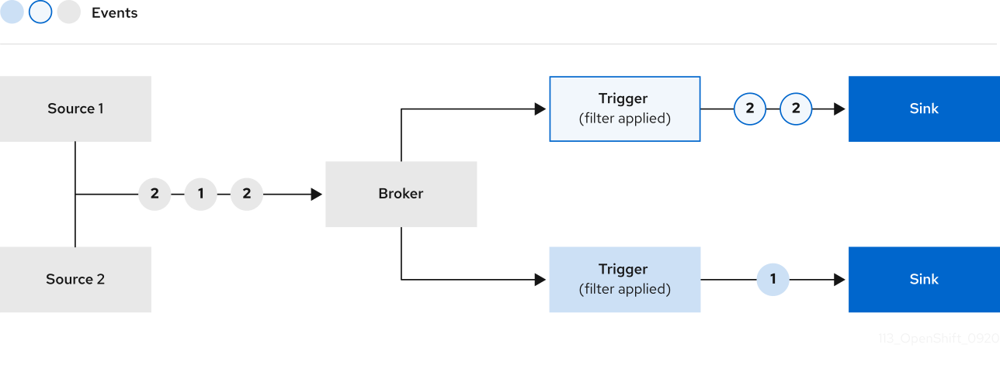

# Knative Playground

## Knative Serving Concepts

Core resources:

- **Services**: *top-level container for managing Route and Configuration.*
- **Routes**: *provides a named endpoint that is backed by one or more Revisions.*
- **Configurations**: *describes the desired state of a Revision, update triggers a new Revision.*
- **Revisions**: *immutable snapshot of code and configuration.*


A few more words about Revisions:

- Support [auto scaling](https://knative.dev/docs/serving/autoscaling/).
- Support [gradual rollout](https://knative.dev/docs/serving/rolling-out-latest-revision/) of traffic.
- Automatically garbage collected.

## Knative Eventing Concepts

Set of APIs which allow to create components which route events from loosely coupled producers to consumers:

- **Event producers / Sources**: *developed and deployed independently, can generate events before a consumer exist.*
- **Event consumers / Sinks**: *can listen to events before producers exist and can send response events.*

Supporting workloads:

- Kubernetes Services
- Knative Serving Services

**Events:**

- Are send via HTTP POST.
- Conform to `CloudEvents` specification => language agnostic.

**Brokers:**

- Provide endpoint for event ingress.
- Deliver events via Triggers.

**Triggers:**

- Can filter events and send them to a Sink / Subscriber.

**Sink**:

- Can be any URL or `Addressable` resource.
- Can reply and respond with a new event.



## Duck Typing

Knative can use a resource without specific knowledge about the resource type, if:

- The resource has the same fields as the common definition specifies.
- The same behaviors as the common definition specifies.

Sounds like **Interfaces**.

## Quickstart

`kn quickstart kind` not working. Using custom script in `cluster/kn8.sh`.

### Serving

Deploy a sample knative hello world service via `kn`:

```sh
kn service create hello \
--image ghcr.io/knative/helloworld-go:latest \
--port 8080 \
--env TARGET=World
```

Or `yaml`:

```yaml
apiVersion: serving.knative.dev/v1
kind: Service
metadata:
  name: hello
spec:
  template:
    spec:
      containers:
        - image: ghcr.io/knative/helloworld-go:latest
          ports:
            - containerPort: 8080
          env:
            - name: TARGET
              value: "World"
```

Get the URL of your service to call it in the browser or terminal:

```sh
# verbose
kn service list
NAME    URL                                       LATEST        AGE     CONDITIONS   READY   REASON
hello   http://hello.default.127.0.0.1.sslip.io   hello-00001   2m30s   3 OK / 3     True

# or short
kn service describe hello -o url
```

Call the route to get a response:

```sh
curl http://hello.default.127.0.0.1.sslip.io

Hello World! # <- response
```

#### Autoscaling

Check how the service is **auto scaled** to zero after a minute and scaled back to two when you send a http request:

```sh
kubectl get po -l serving.knative.dev/service=hello -w
NAME                                      READY   STATUS              RESTARTS   AGE
hello-00001-deployment-5887686fbc-xc68l   1/2     Running             0          1s
hello-00001-deployment-5887686fbc-xc68l   2/2     Running             0          1s
hello-00001-deployment-5887686fbc-xc68l   2/2     Terminating         0          61s
hello-00001-deployment-5887686fbc-xc68l   2/2     Terminating         0          61s
hello-00001-deployment-5887686fbc-xc68l   1/2     Terminating         0          91s
hello-00001-deployment-5887686fbc-xc68l   0/2     Completed           0          91s
hello-00001-deployment-5887686fbc-xc68l   0/2     Completed           0          91s
hello-00001-deployment-5887686fbc-xc68l   0/2     Completed           0          91s
```

Then from another terminal call `curl http://hello.default.127.0.0.1.sslip.io` and see how after a short delay the pod is back to running and responds to the request:

```sh
hello-00001-deployment-5887686fbc-zlggl   0/2     Pending             0          0s
hello-00001-deployment-5887686fbc-zlggl   0/2     Pending             0          0s
hello-00001-deployment-5887686fbc-zlggl   0/2     ContainerCreating   0          0s
hello-00001-deployment-5887686fbc-zlggl   1/2     Running             0          1s
hello-00001-deployment-5887686fbc-zlggl   2/2     Running             0          1s
```

#### Traffic Splitting

Use for blue/green and canary deployments. First create a new *revision* using the cli:

```sh
kn service update hello \
--env TARGET=Knative
```

Or `yaml`:

```yaml
apiVersion: serving.knative.dev/v1
kind: Service
metadata:
  name: hello
spec:
  template:
    spec:
      containers:
        - image: ghcr.io/knative/helloworld-go:latest
          ports:
            - containerPort: 8080
          env:
            - name: TARGET
              value: "World"
```

Url did not change but the revision has a new name *hello-00002*. Lets call the url in the terminal:

```sh
curl http://hello.default.127.0.0.1.sslip.io

Hello Knative!
```

View revisions:

```sh
kn revisions list
NAME          SERVICE   TRAFFIC   TAGS   GENERATION   AGE     CONDITIONS   READY   REASON
hello-00002   hello     100%             2            2m34s   3 OK / 4     True
hello-00001   hello                      1            46m     3 OK / 4     True
```

100% of traffic is going to the latest revision, the highest generation. This is knative default but can be changed via `kn`:

```sh
kn service update hello \
--traffic hello-00001=50 \
--traffic @latest=50
```

Or `yaml`:

```yaml
apiVersion: serving.knative.dev/v1
kind: Service
metadata:
  name: hello
spec:
  template:
    spec:
      containers:
        - image: ghcr.io/knative/helloworld-go:latest
          ports:
            - containerPort: 8080
          env:
            - name: TARGET
              value: "Knative"
  traffic:
  - latestRevision: true
    percent: 50
  - latestRevision: false
    percent: 50
    revisionName: hello-00001
```

Now lets `curl` the service multiple times:

```sh
curl http://hello.default.127.0.0.1.sslip.io
Hello World!
Hello Knative!
```
